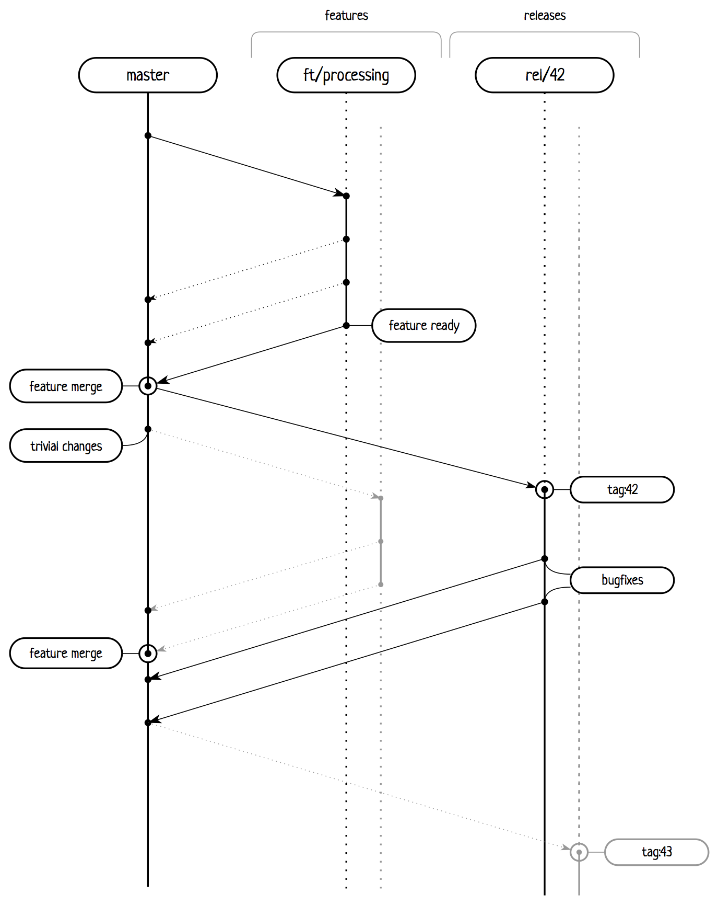

# Работа с системой контроля версий

Рекомендации по работе с системой контроля версий в процессе написания нового функционала, подготовки релиза и правке багов.

## Описание

Подход напоминает сильно упрощённый [git flow](http://jeffkreeftmeijer.com/2010/why-arent-you-using-git-flow/) и почти полностью описывается следующей схемой:

> По вертикали, сверху вниз: время.
>
> По горизонтали, слева направо: ветки, в порядке их появления в рамках жизненного цикла проекта.

Например, для внесения нового функционала необходимо произвести следующие действия:

 - создать _branch_ на базе актуального мастера с названием вида `${TASK_ID}/ft/${FEATURE_NAME}`, где `TASK_ID` – идентификатор задачи в системе управления задачами;
 - внести необходимые изменения в рамках одного или нескольких коммитов;
 - произвести _merge_ всех этих изменений обратно в мастер;
 - создать _branch_ на базе текущего мастера с названием вида `rel/${VERSION}`;
 - сразу сделать _tag_ вида `${VERSION}`;
 - синхронизировать все изменения с сервером репозиториев, чтобы запустить подготовку релиза.

> Формировать `TASK_ID` следует с учётом рекомендаций системы управления задачами, например для успешной интеграции с [Atlassian Jira](https://www.atlassian.com/software/jira) следует использовать исключительно верхний регистр.

Допустимы внесения изменений и без работы в отдельной ветке, в частности:

 - косметические правки и опечатки;
 - изменения, затрагивающие только окружение и инфраструктуру:
     - версии зависимостей,
     - CI-скрипты и манифесты,
     - скрипты для подготовки релиза.

Для правки бага в свою очередь необходимо сделать следующее:

 - сделать _checkout_ релизной ветки `rel/${VERSION}`, где `${VERSION}` – версия проекта, затронутая багом;
 - внести необходимые для починки бага изменения;
 - синхронизировать изменения с сервером репозиториев, чтобы запустить подготовку релиза с текущей ветки;
 - перенести все изменения (_merge_ или _cherry-pick_) на ветку _master_ и на все релизные ветки с версией, больше чем `${VERSION}`.

> Также возможны случаи, когда правка бага происходит и в обратную сторону: необходимые для исправления бага изменения переезжают с ветки _master_ на соответствующие релизные ветки, затронутые этим багом.

Предполагается, что в такой схеме минимальное время жизни _feature_-ветки – до момента появления изменения с этой ветки в _master_, а _release_-ветки – до окончания периода эксплуатации релиза этой версии.

## Общие рекомендации

### Основная ветка

Необходимо исключать попытки _force push_ на ветку _master_, чтобы не портить жизнь ни коллегам, ни автоматизированным сервисам, работающим с вашим репозиторием. Для исключения такой возможности в сервисах хостинга репозиториях часто предусмотрены административные меры, не стоит ими пренебрегать.

### Commit-сообщения

Каждый коммит должен быть снабжен [четким и понятным сообщением](http://chris.beams.io/posts/git-commit/), отображающим суть изменений. В качестве префикса сообщения рекомендуется использовать строку вида `${TASK_ID}: `, где `TASK_ID` – тот самый идентификатор задачи в системе управления задачами.

### Squashing

При подготовке _feature_ или _bugfix_ веток к слиянию, то есть при создании [_PR_](https://help.github.com/articles/using-pull-requests/) или [_MR_](http://doc.gitlab.com/ce/api/merge_requests.html), отправке на _review_, поощряется использование [интерактивного _rebase_](https://git-scm.com/book/en/v2/Git-Tools-Rewriting-History) для объединения или разделения серий (не)связанных изменений, исключения из истории бессмысленных, повторяющихся и промежуточных наборов изменений, правки commit-сообщений.

В таких ситуациях _force push_ на _feature_ или _bugfix_ ветки не только дозволяется, но и поощряется.

### Актуальность feature-веток

Также перед подготовкой веток к слиянию или привнесении актуальных изменений хорошим тоном является _rebase_ на целевую ветку (в подавляющем большинстве случаев – ветку _master_) для сохранения более понятной истории коммитов. Следует исключать появления _merge commit_ов на такого рода ветках.
